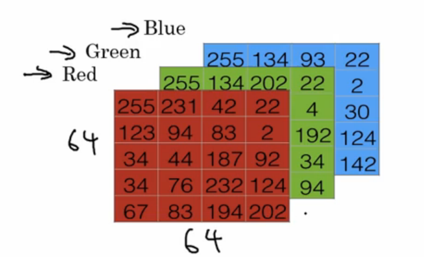

# Basic Knowledge
你需要在本章节学会以下内容:  
使用CMake配置项目;\
从/向磁盘读取、写入图像;\
读取视频和访问相机设备;\
主要图像结构;\
基本矩阵运算简介;\
使用XML/YAML储存OpenCV API进行文件储存操作.
  


## 基本CMake配置文件
CMake使用名为CMakeLists.list的配置文件，用来定义编译和依赖关系过程。
如：
```cmake
#规定CMake最低版本
    cmake_minimum_required(VERSION 3.0)
#定义项目名为HELLO
    project(HELLO)
#将Hello.cpp编译为二进制文件
    ADD_EXECUTABLE( hello Hello.cpp )
```

----------

## 管理依赖项
CMake具备搜索依赖项和外部库的能力，这使我们能够根据项目中的外部组建构建复杂的项目。
现在我们将OpenCV添加到我们的所有项目中：
```cmake
cmake_minimum_required(VERSION 3.0)
project(HELLO)
#Requires OpenCV（找包）
    FIND_PACKAGE(OpenCV REQUIRED)
#Show a message with the opencv version detected
    MESSAGE("OpenCV version : ${OpenCV_VERSION}")
#Add the paths to the include directories/to the header files（包含相关头文件的目录）
    include_directories(${OpenCV_INCLUDE_DIRS})
#Add the paths to the compiled libraries/objects（指定第三方库的路径）
    link_directories(${OpenCV_LIB_DIR})
#Create a variable called SRC
    SET(SRC "Hello.cpp")
#Create our executable
    ADD_EXECUTABLE( hello ${SRC} )
#Link our library    
    TARGET_LINK_LIBRARIES( hello ${OpenCV_LIBS})
```
SET函数用于创建一个新变量，并向其添加我们需要的任何值。在这个例子中，我们将Hello.cpp值合并到SRC变量中，SET函数还可用来向变量中添加多个文件中的值，如：
```
SET(SRC main.cpp
        utils.cpp
        color.cpp
)
```
其中的SET指令可以通过FILE指令更高级的实现，如：
```cmake
#通过FILE指令将src目录下的cpp文件、include目录下的h、hpp文件、cxx_src变量收入GLOB_RECURSE中
file(GLOB_RECURSE cxx_src "src/*.cpp" "include/*.h" "include/*.hpp")
```
如果Cmake没有找到OpenCV包，就会返回错误，但这并不会阻止我们编译应用程序。MESSAGE函数在终端中会显示一条消息，在这个例子中，就显示：
```
OpenCV version : 4.1.1
```
`${OpenCV_VERSION}`使用来储存OpenCV包版本的变量。include_directoried()和link_directories()向环境中添加制定库的头文件和路径。OpenCV Cmake模块将这些数据保存在`${OpenCV_INCLUDE_DIRS}`和`${OpenCV_LIB_DIR}`变量中。  

--------

## 图像与矩阵
在计算机中，图片只是以矩阵格式储存的一系列数字。图像中的每个点都称为像素，并且每个像素可以存储一个值或多个值，这取决与它是否仅储存一个值的黑白图像，还是储存两个值的灰度图像，或者是存储三个值的彩色图像。这些值通常在整数0～255。  
图像是以矩阵格式储存的，其中的每个像素都有一个位置，并且可以通过行和列的编号来引用。OpenCV用Mat类来达到这个目的。在灰度图像中，使用单个矩阵。  

  

--------

## 读、写图像
下面我们来看一下利用OpenCV如何读取图像：
```c++
#include <iostream>
#include <string>
#include <sstream>
using namespace std;

//包含OpenCV相关头文件
#include "opencv2/core.hpp"
#include "opencv2/highgui.hpp"
using namespace cv;

int main ( int argc , const char** argv )
{ 
    //将Mat类实例化为color和gray
    Mat color = imread("index.jpg");
    Mat gray= imread("index.jpg", 0);

    //在终端内输出矩阵的行、列
    cout << color.rows<<"*";
    cout << color.cols<<endl;

    //将gray对象写入lenaGray.jpg
    imwrite("lenaGray.jpg",gray);

    //减1防止数组越界
    int myRow = color.cols-1;
    int myCol = color.rows-1;

    //8位彩色图像中的类型名称为Vec3b类，它储存三个无符号字符数据（Vec=向量，3=组件数，b=一个字节）
    //定义一个Vec3b类的对象pixel，获取color中最后一个像素点的值
    Vec3b pixel=color.at<Vec3b>(myRow,myCol);
    cout << "Pixel value (B,G,R): ("<< (int)pixel[0] << "," << (int)pixel[1] << "," <<(int)pixel[2] <<")"<< endl;

    //显示图片
    imshow("Lena BGR",color);
    imshow("Lena Gray",gray);

    //等待敲击键盘
    waitKey(0);
    return 0;
}
```   
----------------

## 读取摄像头
下面的代码介绍了一个简单的摄像头读取示例：
``` c++
#include <iostream>
#include <string>
#include <sstream>
using namespace std;

#include "opencv2/core/core.hpp"
#include "opencv2/highgui/highgui.hpp"
//imgproc.hpp包含相关头文件
#include "opencv2/imgproc/imgproc.hpp"
using namespace cv;

int main()
{
	//读取视频或摄像头
	VideoCapture capture(0);
	
    //永真循环，即摄像头一直保持打开
	while (true)
	{
		Mat frame;
		capture >> frame;
        //将capture捕获的图像写入frame中。
		imshow("读取视频", frame);
		if (waitKey(1) == 27)//按ESC键
            {
                cout << "程序结束！" << endl;
                cout << "*** ***" << endl;
                //break时，循环结束，窗口关闭。
				break;
            }
	}
	return 0;
}
```
## 读取一段视频
下面的代码介绍了一个读取一个avi视频的简单示例：
```c++
#include <iostream>
#include <string>
#include <sstream>
using namespace std;

#include "opencv2/core/core.hpp"
#include "opencv2/highgui/highgui.hpp"
#include "opencv2/imgproc/imgproc.hpp"
using namespace cv;

int main()
{
    VideoCapture capture;
    //打开avi文件，注意，必须要让程序能够找到视频文件！必须给出文件的相对路径或绝对路径！还有，OpenCV不支持打开mp4格式文件。
    capture.open("../sample.avi");

    while(true)
    {
        Mat frame;
        capture>>frame;
       //注意要进行有效性检测
       if(!cap.isOpened())
            return;
        //如果某帧为空就结束循环，注意，此步骤需要放在imshow之前，否则会报错。（为什么？）
        if (frame.empty())
        {
            cout << "**** ****"<<endl;
            cout << "播放结束"<<endl;
            cout <<endl;
            cout << "**** ****"<<endl;
            break;
        }
        imshow("读取视频",frame);
        waitKey(30);
    }
    //释放资源
    capture.release();
}