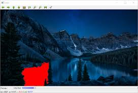

# Learning GUI
## 在学习本章之前，你需要掌握以下基础知识：  

## 你需要在本章节学会以下内容：
||
|---|
|OpenCV基本用户界面|
|OpenCV GUI界面|
|滑块与按钮|
|高级用户界面：OpenCL|
|颜色转换|
|基本滤波器|

如果上述条件你都满足，那么现在让我们开始吧！

---
## OpenCV用户界面介绍
OpenCV拥有自己的跨操作系统用户界面，提供两种用户界面选项：

    1.基于原生用户界面的基本界面，在编译OpenCV时被默认选择；
    2.基于Qt库的略微更高级的界面，这是跨平台的界面，必须在编译OpenCV之前在CMake中手动启用Qt选项。
## OpenCV的基本图形用户界面
下面我们将使用OpenCV创建和显示两个图像，具体来说，可以在桌面上通过按键来显示多个窗口，并使图像移入这些窗口中。下面我们来看看代码：
```c++
#include <iostream>
#include <string>
#include <sstream>
using namespace std;

//导入highgui模块
#include <opencv2/core.hpp>
#include <opencv2/highgui.hpp>
using namespace cv;

int main()
{
    //将上级目录中的lena.jpg读入矩阵lena中
    Mat lena=imread("../lena.jpg");

    //有效性检测
    if(!lena.data){
        cout <<"Lena image missing!"<<endl;
        return -1;
    }
    
    //将上级目录中的photo.jpg读入矩阵photo中
    Mat photo =imread("../photo.jpg");

    //有效性检测
    if(!photo.data){
        cout << "Lena image missing!"<<endl;
        return -1;
    }

    //创建窗口使用nameWindow函数，我们在Note中进行详细介绍
    namedWindow("Lena",WINDOW_NORMAL);
    namedWindow("Photo",WINDOW_AUTOSIZE);

    //当创建多个窗口时，它们是叠加的，但我们可以使用moveWindow函数将窗口移动到桌面的任何区域
    //在这里，我们将Lena窗口向左移动了10个像素，向上移动了10个像素
    moveWindow("Lena",10,10);
    moveWindow("Photo",520,10);

    //在窗口中加载lena和photo矩阵
    imshow("Lena",lena);
    imshow("Photo",photo);

    //将Lena窗口大小调整为512像素，详见Note
    resizeWindow("Lena",512,512);

    waitKey(0);

    //删除刚刚的两个窗口
    destroyWindow("Lena");
    destroyWindow("Photo");

    //创建十个窗口
    for(int i=0;i<10;i++)
    {
        ostringstream ss;
        ss<<"Photo"<<1;
        namedWindow(ss.str());
        moveWindow(ss.str(),20*i,20*i);
        imshow(ss.str(),photo);
    }

    waitKey(0);

    //删除这些窗口
    destroyAllWindows();
    return 0;
}
```
Note：  
1.nameWindow函数，第一个参数是带有窗口名称的字符串，第二个参数是我们需要的标志，第二个参数是可选的，有下面几种类型：

    WINDOW_NORMAL：此标志允许用户调整窗口的大小；
    WINDOW_AUTOSIZE：如果设置了此标志，窗口大小为自动调整适应显示图像
    WINDOW_OPENGL：此标志启用OpenGL支持

2.resizeWindow函数，有三个参数：window name、width和height，注意，工具栏不计算在内。  
3.destroyWindow函数删除这个窗口，唯一需要的参数是窗口名称。  

## Qt图形用户界面
Qt用户界面分为以下三个区域：
工具栏；图像区域；状态栏
    
工具栏从左到右有以下按钮：

    用于平移的四个按钮；
    缩放x1；
    缩放x30，显示标签；
    放大；
    缩小；
    保存当前图像；
    显示属性；

图像区域显示图像，当我们在图像上按下鼠标右键时，显示上下文菜单。你可以使用displayOverlay函数在该区域顶部显示叠加消息，该函数接受三个参数：窗口名称、要显示的文本以及显示叠加文本的时间（单位为ms），如果时间为，则文本永远不会消失。下面的文字来源于官方文档：
```c++
void cv::displayOverlay	(	const String & 	winname,const String & 	text,int delayms = 0 )	
```
我们可以在状态栏中像叠加层一样显示消息，displayStatusBar函数可以更改状态栏的消息，该函数与上面的函数参数一致。

### 将按钮添加到用户界面
OpenCV Qt支持的按钮类型如下：  

    按钮；复选框；单选框。  

这些按钮仅仅出现在控制面板中。控制面板是每个程序的独立窗口，我们可以在里面附加按钮和跟踪条。要显示控制面板可以使用Ctrl+P快捷键，下面我们通过一个简单的代码来看一下：
```c++


